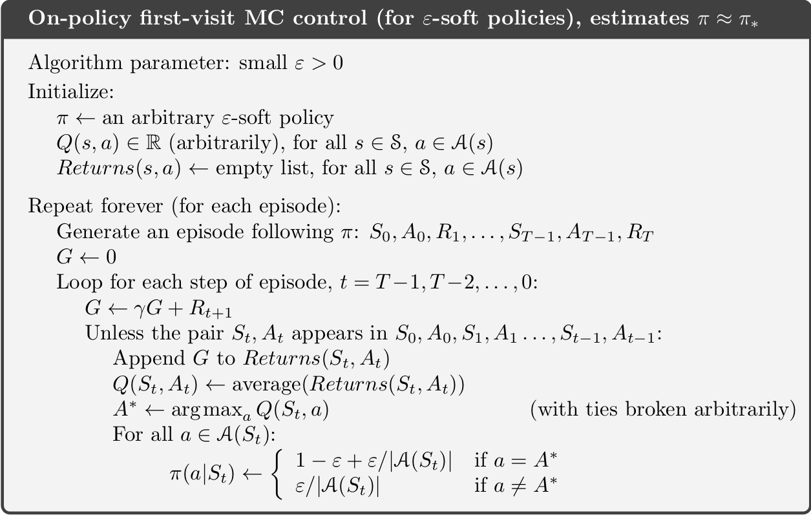

# Reinforcement Learning (Lectures 1-2)

## Introduction

Reinforcement learning is different from supervised learning in that there is no
supervisor, there is only a reward signal. The agent learns on the basis of
trial and error. Also, feedback in Reinforcement Learning may be delayed, not
instantaneous. In RL, time matters. The agent lives in a sequential process,
over time.

### Literature

- [Course](http://www0.cs.ucl.ac.uk/staff/d.silver/web/Teaching.html)
- [Book](https://drive.google.com/file/d/1opPSz5AZ_kVa1uWOdOiveNiBFiEOHjkG/view)
- [Implementation to generate pictures in the book](https://github.com/ShangtongZhang/reinforcement-learning-an-introduction)

### Definition

RL often involves a scalar *reward* signal $R_t$ that the agent receives at each
time step $t$. There is an agent in an environment, whose goal it is to collect
$R_t$ to maximize the total reward. The flexibility comes from the fact that all
goals (and by extension, all problems) can be described via reward signals and
solved by maximization of expected cumulative reward. This is the *reward
hypothesis*.

The goal in RL is always to select actions to maximize total future rewards. But
actions may have long term consequences, so rewards may be delayed. As such, you
cannot simply be greedy all the time. It may, in fact, be better to sacrifice
immediate reward to gain more long term reward (explore rather than exploit).

The relevant variables at time step $t$ are:

1. An observation $O_t$ an agent makes,
2. An action $A_t$ an agent is able to take,
3. A *scalar* reward signal $R_t$ the agent receives in response to that action.

Next to the agent, there is the environment. The agent takes the action on the
environment, thereby influencing it, and the environment consequently produces
the reward and generates a new observation on which the agent can act (take an
action on).

Note that there really always must be a *scalar* reward, or there is at least
always a conversion from the problem to a scalar reward signal possible.

The *history* is the sequence (or stream) of observations, actions and rewards:

$$H_t = A_1,O_1,R_1, ..., A_t,O_t,R_t.$$

The history is thus all the observable variables up to time step $t$. What
happens next depends on the history. The goal of our algorithm is to map the
history to the next action.

The *state* can capture the history. Formally, *state* is a function of the
history:

$$S_t = f(H_t).$$

There are several parts to the definition of state. The first definition is the
environment state $S_t^e$, which is the environment's internal representation of
the state. There is some set of numbers, some state, within the environment
(e.g. the memory in the Atari emulator), which determines what observation the
environment will emit next. This state is usually not visible to the agent. As
such our algorithm can usually not access the numbers in the environment state.
Interestingly, the environment state may actually contain a lot of noise that
the agent may not care about at all.

Furthermore, there is also the *agent state* $S_t^a$, which captures what
observations and rewards we remember and they were attenuated. Part of
reinforcement learning is to build or find the function $f$, of which the agent
state $S_t^a$ is a function of w.r.t. the history.

Note that if there are several agents, they can be, formally, simply be seen as
part of the environment from the perspective of each individual agent.

### Information State

The Markov property is important for RL. It's definition is that "the future is
independent of the past, given the present". It tells us that the current state
holds just as much information as the history, i.e. it holds all useful
information of the history. Symbolically, we call a state $S_t$ *Markov* iff

$$\Pr[S_{t+1} | S_t] = \Pr[S_{t+1} | S_1,...,S_t].$$

That is, the probability of seeing some next state $S_{t+1}$ given the current
state is exactly equal to the probability of that next state given the entire
history of states. Note that we can always find some Markov state. Though the
smaller the state, the more "valuable" it is. In the worst case, $H_t$ is
Markov, since it represents all known information about itself.

### Fully Observable Environment

The "nicest" kind of environment is one which is *fully observable*, meaning the
agent can *directly* observe the environment state. Formally, this means

$$O_t = S_t^a = S_t^e.$$

Conceptually, this means that the environment has no hidden state that the agent
does not know of. The agent knows everything about the environment and an
observation is made about the environment in its entirety.

This is called a *Markov Decision Process* (*MDP*).

### Partial Observability

It may be that our RL agent has only partial observability. For example, a robot
with camera vision isn't told its absolute location, but only its relative
position (the current image), or a trading agent may only be given current
prices, but not the history. A last example is a poker agent that can only
observe public cards. Now, the agent state is no longer equal to the environment
state!

$$S_t^a \neq S_t^e$$

This is called a *Partially Observable Markov Decision Process* (*POMDP*).

In this case, we must find alternative ways to represent the agent state, since
it can no longer be just the environment state. One possibility is to simply set
the agent state to be the history, i.e. $S_t^a = H_t$. Another alternative is to
have a distribution over the possible states of the environment:

$$S_t^a = (\Pr[S_t^e = s^1], ..., \Pr[S_t^e = s^n]).$$

Finally, another possibility would be to have the state of the agent be the
state of a recurrent neural network:

$$S_t = \sigma(S_{t-1}W_s + O_tW_o)$$

### RL Agents

An RL agent may include one or more of these components:

* *Policy*: An agent's behavior function, how the agent picks an action, given its state.
* *Value function*: A function of how good each state and/or action is.
* *Model*: An agent's representation of the environment.

#### Policy

A policy is the agent's behavior. It is a map from state to action, or from
state to a distribution of actions. For example, with a deterministic policy
$\pi$, we could have $a = \pi(s)$, i.e. the policy always returns the same
action for a certain state. However, we may also have a stochastic
(probabilistic) policy, which defines a probability for each action given a
state:

$$\pi(a | s) = \Pr[A = a | S = s].$$

#### Value Function

The value function is a *prediction of expected future reward*. When we have to
make the choice between two options, the value function tells us which state to
transition to. The value function $v$ depends on a policy $\pi$ (we thus speak
of a "value function for a policy") and tells us the expected reward we will
receive over the next few time steps:

$$v_\pi(s) = \mathbb{E}[R_t + \gamma R_{t+1} + \gamma^2 R_{t + 2} + ... | S_t =
s].$$

As such we want to find the policy that maximizes the value function.

Note how we can have a parameter $\gamma \in [0, 1]$ and decay it over next time
steps, basically saying we care more less ($\gamma < 1$) about the upcoming or
later steps. Since this factor will make future rewards unmeasurable small at
one point, we speak of a *horizon*, i.e. a limit to how far the value function
looks ahead.

#### Models

A model predicts what the environment will do next. There are transition models
and reward models. The transition model $\mathcal{P}$ what the next state of the
environment will be, given the current state (dynamics):

$$P_{ss'}^a = \Pr[S' = s' | S = s, A = a].$$

The reward model $\mathcal{R}$ predicts the next (immediate) reward:

$$R_s^a = \mathbb{E}[R | S = s, A = a].$$

### Taxonomy

We can taxonomize reinforcement learning agents into three basic kinds:

1. *Value based* algorithms have no policy and just a value function.
2. *Policy based* algorithms have no value function and just a policy.
3. *Actor critic* algorithms have both policy and value.

Further more, we can differentiate between *model free* and *model based*
agents.

### Problems solved by Reinforcement Learning

There are two fundamental problems in sequential decision making (making optimal
decisions):

1. First, there is the *reinforcement learning problem*. The environment is
initially unknown. Only by interacting with the environment can the agent learn
about and improve its performance in it.

2. Then, there is the *planning problem*. The model is entirely known. The agent
then performs computations with its model (without any external interaction).
The agent then improves its policy.

The difference is really whether or not the environment is known a priori, or
not.

A key problem of reinforcement learning (in general) is the difference between
*exploration* and *exploitation*. Should the agent sacrifice immediate reward to
explore a (possibly) better opportunity, or should it just exploit its best
possible policy?

Exploration finds more information about the environment. Exploitation exploits
known information to maximize reward. A typical example is whether to always
show the most successful ad in an ad slot, or try a new ad, which may not be
more successful, but may in fact end up bringing more revenue than the old one.

A further distinction is between *prediction* and *control*. Prediction means
evaluating a policy to establish its optimality. Control, in turn, means finding
the best policy. Typically, control requires prediction.

## Markov Decision Processes

Markov Decision Processes (MDPs) formally describe an environment for
reinforcement learning. MDPs are important, since most reinforcement learning
problems can be phrased as MDPs. Naturally, an MDP is Markov and thus the
current state completely characterizes the process.

Markov Processes deal with transitions between states. Such a particular
transition from state $s$ to state $s'$ is defined by a *transition probability*
$\mathcal{P}_{ss'}$, given as

$$\mathcal{P}_{ss'} = \Pr[S_{t+1} = s' | S_t = s].$$

The *state transition matrix* $\mathcal{P}$ defines all such transition
probabilities from any state $s$ to a state $s'$:

$$
\mathcal{P} =
\begin{bmatrix}
  \mathcal{P}_{11} & \dots & \mathcal{P}_{1n} \\
  \vdots & \ddots & \vdots \\
  \mathcal{P}_{n1} & \dots & \mathcal{P}_{nn} \\
\end{bmatrix}
$$

Here, the first index (the rows) is the source state and the second index (the
columns) is the destination state.

To summarize, we can say that a Markov Process is a *memoryless random process*,
i.e. a sequence of random states $S_1, S_2, ...$ that are Markov (have the
Markov property). Formally, we can now represent such an MDP as a pair
$(\mathcal{S, P})$, where $\mathcal{S}$ is the finite set of all possible states
and $\mathcal{P}$ is the transition matrix.

### Markov Reward Process

The next step to go from Markov Decision Processes towards Reinforcement
Learning is a reward signal. For this, we now define a *Markov Reward Process*
(*MRP*), which is characterized by a tuple $(\mathcal{S, P, R, \gamma})$.
$\mathcal{S, P}$ are defined as before, but we now have

1. $\mathcal{R}$, the reward signal, defined as $\mathcal{R}_s = \mathbb{E}[R_{t+1} | S_t = s]$
2. A real discount factor $\gamma \in [0, 1]$ that decays the reward as we look further into the future.

Further, we define a *return* $G_t$ as the total, discounted, reward from
time-step $t$ onwards:

$$G_t = R_{t+1} + \gamma R_{t+2} + ... = \sum_{k=0}^\infty \gamma^k R_{t+1+k}.$$

Note that $G_t$ does not involve any expectation. This is because $G_t$ is not
an estimation of the reward, but the value we would get if we would actually
sample the reward infinitely into the future. One way to interpret the discount
factor $\gamma$ is to say that:

- If $\gamma \approx 0$, we care a lot more about immediate reward,
- If $\gamma \approx 1$ we don't care necessarily when rewards arrive, just about their sum within some time horizon.

In RL we usually do use a discount factor, mainly because of *uncertainty*. If
we are not fully certain that our model of the world is perfect, it is much more
risky to "trust" the model to make accurate predictions far a long the way. We
have more certainty in immediate actions (assuming that uncertainty multiplies
over time). Another reason to have a discount factor is to avoid unbounded
mathematics. You can think of the discount factor as the inverse of an "interest
rate".

Given that we now have the definition of a reward $G_t$, we can redefine a value
function $v$ as:

$$v(s) = \mathbb{E}[G_t | S_t = s].$$

What we can do now is perform some transformations on this equation to get
something that we ultimately know as the *Bellman equation*:

$$v(s) = \mathbb{E}[G_t | S_t = s] $$
$$= \mathbb{E}[R_{t+1} + \gamma R_{t+2} + \gamma^2 R_{t+3} + ... | S_t = s] $$
$$= \mathbb{E}[R_{t+1} + \gamma(R_{t+2} + \gamma R_{t+3} + ...) | S_t = s] $$
$$= \mathbb{E}[R_{t+1} + \gamma G_{t+1} | S_t = s] $$
$$= \mathbb{E}[R_{t+1} + \gamma v(t+1)  | S_t = s] $$

This fundamental knowledge conveys that the expected value at the current state
$s$ is equal to the immediate reward, plus some discounted amount of the
expected reward in the next state. Note here that denoting the reward received
at time step $t$ with $R_{t+1}$ is a notational convention signifying that it is
the reward we would receive from the environment in the next time step, *once we
have engaged with it*.

Now, let us see how we actually compute the value function $v(s)$ in state $s$.
Very simply, this value is given by

$$v(s) = R_{t+1} + \gamma\sum_{s' \in \mathcal{S}} \mathcal{P}_{ss'}v(s'),$$

where $\mathcal{S}$ is the set of all states (practically speaking, all states
reachable from $s$) and $\mathcal{P}_{ss'}$ the probability of transitioning
into state $s'$ from our current state $s$. So in this definition, the value
function for a particular state $s$ is equal to the immediate reward, plus a
discounted amount of the weighted sum of the value of all states reachable from
$s$.

There is a much nicer formulation of the Bellman equation with matrices and
vectors. For this, let us define $\mathbf{v} = [v(s_1), ..., v(s_n)]^\top$ as
the vector of all value-function values at time step $t$ and $\mathbf{R} =
[\mathcal{R}_{t+1}^{(1)}, ..., \mathcal{R}_{t+1}^{(n)}]^\top$ as the vector of reward
values in each state at $t$. Then the Bellman equation in vectorized form is
given by

$$\mathbf{v} = \mathbf{R} + \gamma\mathcal{P}\mathbf{v}.$$

Note how the $i$-th component of $\mathcal{P}\mathbf{v}$ will contain $\sum_{s'
\in \mathcal{S}}\mathcal{P}_{s_is'} v(s')$, i.e. precisely the same linear combination
of all states that we could transition into.

What is interesting to note at this point is that the above Bellman equation is
actually just a linear system of equations that we could solve:

$$\mathbf{v} = \mathbf{R} + \gamma\mathcal{P}\mathbf{v} $$
$$\mathbf{v} - \gamma\mathcal{P}\mathbf{v} = \mathbf{R} $$
$$(\mathbf{I} - \gamma\mathcal{P})\mathbf{v} = \mathbf{R} $$
$$\mathbf{v} = (\mathbf{I} - \gamma\mathcal{P})^{-1}\mathbf{R} $$

where $(\mathbf{I} - \gamma\mathcal{P})^{-1}$ is a matrix inversion and the main
expensive operation. Its computational complexity is $O(n^3)$ for $n$ states and
thus generally infeasible. As such, there exist other methods of evaluating the
value function, including dynamic programming methods, Monte Carlo evaluation
and Temporal-Difference learning.

### Markov Decision Process (2)

So far, we have been discussing Markov Reward Processes. This allows our agent
to be in states, receive rewards for being in a state and estimate the
expected cumulative reward over all future states. However, we do not yet have
the power to actually influence how we get into a particular state, apart from
there being a certain probability. For this reason, Markov Decision Processes
(MDPs) add a set of actions $\mathcal{A}$ to our model, making it a five-tuple:

$$(\mathcal{S, A, P, R, \gamma})$$

Furthermore, since the actions are now what really influence state transitions,
the transition probability matrix $\mathcal{P}$ and reward signal $\mathcal{R}$
are now defined differently:

$$\mathcal{P}_{ss'}^a = \Pr[S_{t+1} = s' | S_t = s, A_t = a]$$
$$\mathcal{R}^a_s = \mathbb{E}[R_{t+1} | S_t = s, A_t = a]$$

basically, transition probabilities and reward signals are now associated with
edges, meaning actions, and not vertices, representing states, in the state
transition diagram. We now get a transition probability $\mathcal{P}_{ss'}^a$
representing the likelihood of moving into state $s'$ given that we are in state
$s$ and take action $a$. Similarly, rewards are now a function of the state
*and* an action.

At this point, it is time to introduce the *policy*. A policy $\pi$ is a
distribution over actions, given some state:

$$\pi(a | s) = \Pr[A_t = a | S_t = s].$$

For now, these policies are stationary, meaning *time-independent* ($A_t \sim
\pi(\cdot|s_t)\,\forall t$). Also, since we are dealing with Markov Processes,
the policy depends only on the state and not on the entire history (since it is
encapsulated by the state).

An interesting fact is that we can always recover an MRP (no actions) from an
MDP (actions). For this, we simply set the transition probability
$\mathcal{P}^\pi_{ss'}$ for the MRP to the average probability of that state
transition across all actions we can take from state $s$:

$$\mathcal{P}^\pi_{ss'} = \sum_{a \in \mathcal{A}} \pi(a|s) P^a_{ss'}$$

and do the same for the reward

$$\mathcal{R}^\pi_s = \sum_{a \in \mathcal{A}} \pi(a|s) R^a_s.$$

#### Value Function for MDPs

We now need two further definitions of the value function for MDPs. The first
value function we define is the *state-value function* $v_\pi(s)$, which is the
expected return starting from state $s$ and strictly following the policy $\pi$:

$$  v_\pi(s) = \mathbb{E}_\pi[G_t | S_t = s] $$
$$= \mathbb{E}_\pi[R_{t+1} + \gamma v_\pi(S_{t+1}) | S_t = s].$$

This is the value function we have been referring to so far. The second value
function is the *action-value function* $q_\pi(s, a)$, defined as the expected
return starting from state $s$, taking action $a$ and from thereon following
policy $\pi$:

$$q_\pi(s, a) = \mathbb{E}_\pi[G_t | S_t = s, A_t = a] $$
$$= \mathbb{E}_\pi[R_{t+1} + \gamma q_\pi(S_{t+1}, A_{t+1}) | S_t = s, A_t = a] $$

This action-value, also known as "q-value", is very important, as it tells us
directly what action to pick in a particular state.

Given the definition of q-values, we can now better understand the state-value
function as an average over the q-values of all actions we could take in that
state:

$$v_\pi(s) = \sum_{a \in \mathcal{A}}\pi(a|s)q_\pi(s, a)$$

So state-value = average q-value.

We can now also define the action-value in terms of state values (notice the
recursive/recurrent definitions here). Basically, a q-value (action-value) is
equal to the reward $\mathcal{R}_s^a$ that we get from choosing action $a$ in
state $s$, plus a discounted amount of the average state-value of all states we
could end up in given we choose that action:

$$q_\pi(s, a) = \mathcal{R}_s^a + \gamma\sum_{s' \in \mathcal{S}} P_{ss'}^a v_\pi(s')$$

Note how this is quite similar to the definition we had for the state-value in
Markov Reward Processes. So MRP state values are basically like q-values (one
per state, whereas now we have one per action). So we know that state-values are
a weighted sum of q-values and q-values a weighted sum of state-values. Putting
these two things together, we can now get a better intuition of the state-value
of a particular state $s$ as the sum of weighted state-values of all possible
subsequent states $s'$, where the weights are probabilities:

$$v_\pi(s) = \sum_{a \in \mathcal{A}}\pi(a | s)q_\pi(s, a) $$
$$= \sum_{a \in \mathcal{A}}\pi(a | s)\left(\mathcal{R}_s^a + \gamma\sum_{s' \in \mathcal{S}}\mathcal{P}_{ss'}^a v_\pi(s')\right) $$

in exactly the same way we can define a q-value as a weighted sum of the
q-values of all states we could reach given we pick the action of the q-value:

$$q_\pi(s, a) = \mathcal{R}_s^a + \gamma\sum_{s' \in \mathcal{S}} P_{ss'}^a v_\pi(s') $$
$$= \mathcal{R}_s^a + \gamma \sum_{s' \in \mathcal{S}} \mathcal{P}_{ss'}^a \sum_{a' \in \mathcal{A}} \pi(a'|s')q_\pi(s',a')$$
At this point, we can define our ultimate goal as finding an optimal state-value
function

$$v_\star(s) = \max_\pi v_\pi(s)$$

or, more importantly, an optimal q-value/action-value function

$$q_\star(s, a) = \max_\pi q_\pi(s, a)$$

i.e. the action-value function using the policy that maximizes the expected
reward. When you have $q_\star(s, a)$, you are done.

One thing you may ask at this point is how value functions can actually be
compared to find a maximum value function. For this to be allowed, we need to
define a partial ordering over policies and value functions:

$$\pi \geq \pi' \Longleftrightarrow v_\pi(s) \geq v_\pi'(s)\, \forall s$$

with emphasis on the $\forall s$, i.e. for all states. Given this ordering, we
can now lay down a theorem that states that:

*For any MDP there exists an optimal policy $\pi_\star$ that is better than or equal to all other policies*, i.e.

$$\exists\pi_\star: \pi_\star \geq \pi, \forall \pi$$

For all such optimal policies (there may be more than one), the corresponding
state-value and action-value functions $v_{\pi_\star}(s) = v_{\star}(s)$ and
$q_{\pi_\star}(s, a) = q_{\star}(s, a)$ are also optimal. What is nice here is
that this means that we only need to find this one optimal policy and we'll
always be able to pick the right action in every state. One way to find this
optimal policy is to maximize over the optimal action-value function:

$$
\pi_\star(a | s) =
\begin{cases}
1 \text{ if } a = argmax_{a \in \mathcal{A}} q_\star(s, a) \\
0 \text { otherwise }
\end{cases}
$$

This policy would basically assign all the mass of the probability distribution
to the action with the highest q-value, according to the optimal action-value
function, and give other actions a likelihood of 0.

#### Bellman Optimality Equation

While the previous Bellman equations first defined our state-value and q-value
function, the *Bellman optimality equations* actually define how to find the
optimal value functions.

The optimal state-value function $v_\star(s)$ can be found by taking the optimal
action-value function $q_\star$ and for each state, picking the action with the
highest action-value:

$$v_\star(s) = \max_a q_\star(s, a).$$

On the other hand, the optimal action-value function $q_\star$ is found as the
weighted sum of the state-values of all states reached by taking the optimal
action, as determined by the policy $\pi$:

$$q_\star(s, a) = \mathcal{R}_s^a + \gamma\sum_{s \in \mathcal{S}} \mathcal{P}_{ss'}^a v_\star(s).$$

Plugging the Bellman optimality equation for the action-value function into that
of the state-value function gives us a recursive definition of the value
function that we could, theoretically, solve (but approximate in practice):

$$
v_\star(s) = \max_a \left(\mathcal{R}_s^a + \gamma\sum_{s \in \mathcal{S}} \mathcal{P}_{ss'}^a v_\star(s)\right)
$$

and the same for the optimal q-value function:

$$
q_\star(s, a) = \mathcal{R}_s^a + \gamma\sum_{s \in \mathcal{S}} \mathcal{P}_{ss'}^a \max_a q_\star(s, a).
$$

Note how the optimal state-value is determined by the optimal action-value
($\max_a$), while the optimal action-value is given by an *average* (weighted
sum) over all reachable state-values. This is because when we are in a state, we
actually get to pick the action, while once we've picked the action, it is the
transition probabilities (over which we have no control) that determine the
next states and thus the next optimal state-values.

# Reinforcement Learning (Lecture 3)

## Dynamic Programming

*Dynamic Programming* deals with dynamic, sequential or temporal problems. In
mathematics, a "program" is not a computer program, but more of a policy, i.e.
guide for an agent. An example would be linear or quadratic programming. The
basic idea behind dynamic programming is to take a problem, break it down into
smaller subproblems that look identical to the original problem, solve those
subproblems, combine them in a way and ultimately solve the overall problem.

A problem must satisfy two criteria to be considered a *dynamic programmming*
problem:

1. It must have an *optimal substructure*.
   This means that the *principle of optimality* applies. Basically, the optimal
   solution should be decomposable into subproblems.
2. The subproblems *overlap*, meaning they recur again and again (so caching helps).

Markov Decision Processes (MDPs) satisfy both of these properties, since they
can be described via a Bellman equation. The Bellman equation is inherently
recursive, satisfying property (1) of optimal substructure. Furthermore, the
value function of our MDP is, in fact, a kind of cache or recombination of past
states.

The two problems we want to solve with Dynamic Programming are *prediction* and
*control*. The prediction problem takes an MDP description and a policy $\pi$
and gives us a value function $v_\pi$ that allows us to calculate the expected
return in a given state. The control problem then involves optimizing this value
function. As such, it gets an MDP description as input and produces an *optimal*
value function $v_star$. The control problem will most likely be a loop, over
all policies, and picking the optimal policy after having evaluated each one.

## Policy Evaluation

The first application of dynamic programming to our reinforcement learning
problem that we want to investigate is *policy evaluation*. The goal of policy
evaluation is to find a better policy given an initial policy $\pi$ (and an MDP
model $(\mathcal{S, A, P, R, \gamma})$). To do so, we use the Bellman
expectation equation for the value function:

$$v_{k+1}(s) = \sum_{a \in \mathcal{A}} \pi(a|s) q_\pi(s, a) $$
$$= \sum_{a \in \mathcal{A}} \pi(a|s)\left(\mathcal{R}_s^a + \gamma\sum_{s' \in \mathcal{S}} \mathcal{P}_{ss'}^a v_k(s')\right)$$

In a single update (backup) of the iterative process we would thus, for each
state, evaluate all actions we can pick from that state, and for each state
compute a weighted sum of the *old* state-values of all states reachable when
picking that action.

## Policy Iteration

Now that we have means to evaluate a policy iteratively, we can look into finding an optimal policy. In general, this is composed of two simple steps:

1. Given a policy $\pi$ (initially $\pi_0$), estimate $v_\pi$ via the policy
evaluation algorithm (iterating a fixed number of times or until it stabilizes),
giving you

  $$v_\pi(s) = \mathbb{E}[R_{t+1} + \gamma R_{t+2} + \gamma^2 R_{t+3} + ... | S_t = s]$$
2. Generate a new, improved policy $\pi' \geq \pi$ by *greedily* picking

  $$\pi' = \text{greedy}(v_\pi)$$
  Then go back to step (1) to evaluate the policy.

Let's try to understand this deeper. To do so, consider a deterministic policy
$\pi(s) = a$. Then what we are doing in the above two steps is the following:

$$\pi'(s) = argmax_{a \in \mathcal{A}} q_\pi(s, a)$$

i.e. our new policy will, in each state, pick the action that "gives us the most
q". Now, we can set up the following inequality:

$$
q_\pi(s, \pi'(s)) = \max_{a \in \mathcal{A}} q_\pi(s, a) \geq q_\pi(s, \pi(s)) = v_\pi(s)
$$

which proves that this greedy policy iteration strategy does indeed work, since
the return we get from starting in state $s$, greedily choosing the locally best
action $argmax_{a \in \mathcal{A}} q(s, a)$ and from thereon following the old
policy $\pi$, must be at least as high as if we had chosen any particular action
$\pi(s)$ and not the optimal one (basically, the maximum of a sequence is at
least as big as any particular value of the sequence).

(Note: I assume the equality in $q_\pi(s, \pi(s)) = v_\pi(s)$ is meant in
expectation?)

What we can show now is that using this greedy strategy not only improves the
next step, but the entire value function. For this, we simply need to do some
expansions inside our definition of the state-value function as a Bellman
expectation equation:

$$v_\pi(s) \leq q_\pi(s, \pi'(s)) = \mathbb{E}_{\pi'}[R_{t+1} + \gamma v_\pi(S_{t+1}) | S_t = s] $$
$$\leq \mathbb{E}_{\pi'}[R_{t+1} + \gamma q_\pi(S_{t+1}, \pi'(S_{t+1})) | S_t = s] $$
$$\leq \mathbb{E}_{\pi'}[R_{t+1} + \gamma (R_{t+2} + \gamma^2 v_\pi(S_{t+2})) | S_t = s] $$
$$\leq \mathbb{E}_{\pi'}[R_{t+1} + \gamma R_{t+2} + \gamma^2 q_\pi(S_{t+2}, \pi'(S_{t+2})) | S_t = s] $$
$$\leq \mathbb{E}_{\pi'}[R_{t+1} + \gamma R_{t+2} + \gamma^2 R_{t+3} + ...)) | S_t = s] $$
$$= v_{\pi'}(s)$$

So in total, we have $v_\pi(s) \leq v_{\pi'}(s)$. Furthermore, if at one point
the policy iteration stabilizes and we have equality in the previous equation

$$
q_\pi(s, \pi'(s)) = \max_{a \in \mathcal{A}} q_\pi(s, a) = q_\pi(s, \pi(s)) = v_\pi(s)
$$

then we also have

$$\max_{a \in \mathcal{A}} q_\pi(s, a) = v_\pi(s)$$

which is precisely the Bellman optimality equation. So at this point, it holds that

$$v_\pi(s) = v_\star(s)\, \forall s \in \mathbb{S}.$$

The last question we must answer is how many steps of policy iteration we should
do to find the optimal policy? Definitely not infinitely many, since we often
notice that the value function stabilizes quite rapidly at some point. So there
are two basic methods:

1. Use $\varepsilon$-convergence, meaning we stop when all values change less than some amount $\varepsilon$ or
2. Just use a fixed number of steps $k$ (thereby introducing another hyperparameter).

## Value Iteration

The next dynamic programming method we want to consider is *value iteration*. In
this case, it is not directly our aim to improve the policy, but rather aims
directly at improving the value function (policy iteration does this as well,
but as a side effect). Basically, while policy iteration iterated on the Bellman
expectation equation, value iteration now iterates on the Bellman *optimality*
equation via the following update rule:

$$
v_\star(s) \gets \max_{a \in \mathcal{A}} \mathcal{R}_s^a + \gamma\sum_{s' \in \mathcal{S}} \mathcal{P}_{ss'}^a v_\star(s')
$$

or, for the step $k \rightarrow k + 1$:

$$
v_{k+1} \gets \max_{a \in \mathcal{A}} \mathcal{R}_s^a + \gamma\sum_{s' \in \mathcal{S}} \mathcal{P}_{ss'}^a v_k(s')
$$

Notice how we assume we already know the solutions to the "subproblems", i.e.
$v_\star(s')$ and then work backwards to find the best solution to the actual
problem (essence of dynamic programming). As such, practically, we can begin
with some initial estimate of the target state-value and then iteratively update
the previous state-values.

Note how value-iteration effectively combines one sweep of policy evaluation,
i.e. one "backup", with one step of policy iteration (improvement), since it
performs a greedy update while also evaluating the current policy. Also, it is
important to understand that the value-iteration algorithm does not require a
policy to work. No actions have to be chosen. Rather, the q-values (rewards +
values of next states) are evaluated to update the state-values. In fact, the
last step of value-iteration is to *output* the optimal policy $\pi^\star$:

$$
\pi^\star(s) = argmax_a q(s, a) = argmax_a R_s^a + \gamma\sum_{s' \in \mathcal{S}} P_{ss'}^a v_{\pi^\star}(s')
$$

To derive the above equation, remind yourself of the Bellman optimality equation
for the state-value function:

$$v_\star(s) = \max_a q_\star(s, a)$$

and that for the action-value function:

$$q_\star(s, a) = \mathcal{R}_s^a + \gamma\sum_{s \in \mathcal{S}} \mathcal{P}_{ss'}^a v_\star(s)$$

and plug the latter into the former. Basically, at each time step we will update
the value function for a particular state to be the maximum q value.

## Summary of DP Algorithms (so far)

At this point, we know three DP algorithms that solve two different problems. We
know the *policy evaluation*, *policy iteration* and *value iteration*
algorithms that solve the prediction (1) and control (2, 3) problems,
respectively. Let's briefly summarize each:

1. The goal of __policy evaluation__ is to determine $v_\pi$ given $\pi$. It does so
by starting with some crude estimate $v(s)$ and iteratively evaluating $\pi$.
$v(s)$ is updated to finally give $v_\pi$ via the *Bellman expectation
equation*:

$$v_{k+1} = \sum_{a \in \mathcal{A}} \pi(a|s) q_\pi(s, a) $$
$$= \sum_{a \in \mathcal{A}}\pi(a | s)\left(R_s^a + \gamma\sum_{s \in \mathcal{S}} P_{ss'}^a v_k(s')\right)$$

2. __Policy iteration__ combines policy evaluation and the Bellman expectation
equation with updates to the policy. Instead of just updating the state values,
we also update the policy, setting the chosen action in each state to the one
with the highest q-value:
    1. Policy Evaluation,
    2. $\pi' = \text{greedy}(v_\pi)$
Policy iteration algorithms have a time-complexity of $O(mn^2)$ for $m$ actions and $n$ states.
3. Lastly, __Value iteration__ uses the Bellman *optimality* equation to
iteratively update the value of each state to the maximum action-value
attainable from that state
$$
v_{k+1} \gets \max_{a \in \mathcal{A}} q_\pi(s, a) = \max_{a \in \mathcal{A}} \mathcal{R}_s^a + \gamma\sum_{s' \in \mathcal{S}} \mathcal{P}_{ss'}^a v_k(s')
$$
and finally also outputs the optimal policy: $\pi^\star(s) = argmax_a q(s, a)$
Value iteration algorithms have a time-complexity of $O(m^2n^2)$ for $m$ actions and $n$ states.

## Extensions

One extension to dynamic programming as we have discussed it above is
*asynchronous* DP, where states are updated individually, in any order. This can
significantly improve computation.

The first way to achieve more asynchronous DP is to use *in-place DP*.
Basically, instead of keeping a copy of the old and new value function in each
value-iteration update, you can just update the value functions in-place. The
thing to note here is that asynchronous updates in other parts of the
state-space will directly be affected by this. However, the point is that this
is not actually a bad idea.

An extension of this is *prioritized sweeping*. The idea here is to keep track
of how "effective" or "significant" updates to our state-values are. States
where the updates are more significant are likely further away from converging
to the optimal value. As such, we'd like to update them first. For this, we
would compute this significance, called the *Bellman error*:

$$|v_{k+1}(s) - v_k(s)|$$

and keep these values in a priority queue. You can then efficiently pop the top
of it to always get the state you should update next.

An additional improvement is to do *prioritize local updates*. The idea is that
if your robot is in a particular region of the grid, it is much more important
to update nearby states than faraway ones.

Lastly, in very high dimensional spaces and problems with high branching factor,
it makes sense to sample actions (branches).

# Reinforcement Learning: Model Free Prediction (Lecture 4)

## Monte-Carlo Reinforcement Learning

The idea of *Monte-Carlo (MC) Reinforcement Learning* is to learn the value
function directly from experience. For this, the environment must be episodic
and finite, i.e. we have to be able to simulate it to the end. However, we do
not need a model for MC, i.e. no transition probabilities $\mathcal{P}_{ss'}$
and no reward function $\mathcal{R}$. The basic principle is to sample results
and average over them.

There are two basic variants of MC RL. The first is *first-visit* MC and the
second is *every-visit* MC. For each method, we will maintain three statistics
for each state: a counter $N(s)$, an accumulated return $S(s)$ and a mean
expected return $V(s)$, which are updated in the following way:

$$N(s) \gets N(s) + 1 $$
$$S(s) \gets S(s) + G_t $$
$$V(s) \gets S(s)/N(s) = \frac{1}{N(s)}\sum_t G_t$$

where we can be assured that $V(s)$ converges to $v_\pi(s)$ (the true
policy/distribution) as $N(s) \rightarrow \infty$ because of the law of large
numbers. The only difference between first-visit and every-visit MC is that if,
in a particular episode, we reach a state more than once, the former method will
only increment the counter once, while the latter will increment it on every
visit.

An important modification we need to make to the update rule for $V(s)$ is to
make the mean incremental. Recall for this that the following transformations
turn the computation of a mean over some quantity $x_i$ into an incremental
update:

$$\mu_t = \frac{1}{t}\sum_i^t x_i $$
$$= \frac{1}{t}(x_t + \sum_i^{t-1} x_i) $$
$$= \frac{1}{t}(x_t + (t-1)\mu_{t-1}) $$
$$= \frac{x_t}{t} + \frac{t\mu_{t-1}}{t} - \frac{\mu_{t-1}}{t} $$
$$= \frac{t\mu_{t-1}}{t} + \frac{x_t}{t} - \frac{\mu_{t-1}}{t} $$
$$= \mu_{t-1} + \frac{1}{t}(x_t - \mu_{t-1})$$

where, intuitively, on each time step, we are computing the difference between
our old mean $\mu_{t-1}$ and the new sample $x_t$ and adding a proportional
fraction of that to the old mean. As such, we can rewrite $V(s)$ as an
incremental mean:

$$V(S_t) \gets S(S_t) + \frac{1}{N(S_t)}(G_t - V(S_t))$$

Alternatively, we can "forget" about old episodes and just use a constant update
factor $\alpha$:

$$V(S_t) \gets S(S_t) + \alpha(G_t - V(S_t))$$

also giving us another hyperparameter to tweak. This doesn't just save us one
integer, it also encapsulates the idea of forgetting old information that we may
not necessarily want, for example in non-stationary problems.

Note that the Monte Carlo algorithm is a little different in practice than in
theory. In practice what we will do is assume some policy $\pi$ and then, rather
than do a rollout for each state, do one rollout (episode). Once we've sampled a
single rollout, we can loop through every state we've encountered along the way
and perform the $\text{total return} / \text{number of visits}$ update. To
compute the total return for each state, an efficient method is to loop through
the array backwards and multiply the accumulated reward with $\gamma$ each time
(instead of looping forwards $N$ times, making each update quadratic).

## Temporal Difference Learning

*Temporal Difference (TD) Learning* is another method that learns directly from
experience and is model free. More interestingly and different from Monte Carlo
methods, TD works with *incomplete* episodes via a process known as
*bootstrapping*. Basically, guesses are updated towards further guesses.

In the simplest TD learning algorithm, called TD(0), the update rule for the
value function replaces the expected total return $G_t$ with the immediate
return $R_{t+1} + \gamma V(S_{t+1})$ for the next step:

$$V(S_t) \gets V(S_t) + \alpha(R_{t+1} + \gamma V(S_{t+1}) - V(S_t))$$

where $R_{t+1} + \gamma V(S_{t+1})$ is termed the *TD target* and $\delta_t =
R_{t+1} + \gamma V(S_{t+1}) - V(S_t)$ the *TD error*. What this algorithm does
is update the value $V(S_t)$ for state $S_t$ by adding a discounted amount of
the expected return for the next state $S_{t+1}$ that we are just about to go
into. Note that $V(S_{t+1})$ is something we can already compute, simply by
seeing what our current value function estimate $V(s)$ gives us for this next
state $S_{t+1}$.

Intuitively, we are updating our estimate of the value of state $S_t$ by looking
ahead one time step and seeing what the value of the next state is according to
our current value function. Note also that $R_{t+1} + \gamma V(S_{t+1})$ is the
right hand side of the Bellman equation.

The main difference between TD and MC is that TD can learn without knowing the
final outcome. We don't have to complete the entire episode to perform one
update to $V(S_t)$, we only need to look ahead one time step.

Notice also that $R_{t+1} + \gamma V(S_{t+1})$ is a *biased* estimate of
$v_\pi(S_t)$. This is actually one of the other domains where we see major
differences between MC and TD:

- MC has *high variance*, but no *bias*. It therefore always converges.
- TD has *low variance*, but some *bias*. However, it is more efficient.

TD is also more sensitive to the initial value function, since it depends on
itself.

In terms of methods, once more, the difference between TD and MC is that MC
always "rolls out" a whole simulation until it terminates, then takes the real
return to update the estimations of all states on the way back. On the other
hand, TD makes only local lookaheads, moving each state's value estimate closer
to the estimate of the next state. Moreover, the following two things are true
w.r.t. these two methods:

1. MC converges to the solution with minimum squared error, since it updates the
estimates directly with actual returns.

  $$\min \sum_{k=1}^K\sum_{t=1}^{T_k} (g^k_t - V(s_t^k))^2$$
2. TD(0) converges to the *maximum likelihood path through the Markov model that best fits the data*.

(2) is quite remarkable, as TD will actually *find* an MDP representation of the
observations and pick the maximum likelihood path through it. As such, we can
state that TD better exploits the Markov property and is thus better for
problems that are directly explainable as MDPs, while MC will work better in
contexts that aren't always Markov.

Note that one reason why temporal difference learning works only in the forward
direction and not in the backward direction (updating $S_{t+1}$ given $S_t$) is
because on the step from $t$ to $t+1$, we see one step of the "real world", the
real reward and real dynamics (transition probabilities). On the other hand, on
the step backwards, we don't know the reward (since the reward is given for the
action, not the reverse action) (?).

## $TD(\lambda)$

At this point, we have a spectrum of reinforcement learning algorithms with two axes:

1. Whether to do full backups or only sample backups (width of search),
2. Whether to do deep backups or only shallow backups (height/depth of search).

This gives us the following table:

|                | Sample Backup  | Full Backup |
| :------------- | :------------- | :---------- |
| Shallow Backup | TD             | DP          |
| Deep Backup    | MC             | Exhaustive  |

The next class of algorithms is a generalization of temporal difference learning
as we know it right now. This new class is called $TD(\lambda)$.

Before we discuss $TD(\lambda)$, let's start by modifying our original TD
algorithm. The change we make is to introduce a hyperparameter $n$ that controls
how far in the future we look when updating a state (or rather, how far
backwards we look to update prior states). So far, we've encountered the TD(0)
method, where $n = 1$ (note $n$ is not the $0$ in the $TD$). The next step would be to have $n = 2$, where the update equation becomes:

$$V(S_t) \gets V(S_t) + \alpha(R_{t+1} + \gamma R_{t+2} + \gamma^2 V(S_{t+2}) - V(S_t)))$$

Notice how we now add the reward $R_{t+2}$ of the action taken in time step
$t+1$ instead of the state value, while we now add the value of the state one
step further, at $t+2$. We can generalize this by setting $G_t^{(n)}$ to the
$n$-step lookahead state value:

$$G_t^{(n)} = R_{t+1} + \gamma R_{t+2} + ... + \gamma^{n-1} R_{t+n} + \gamma^n V(S_{t+n})$$

where Monte Carlo learning would be equivalent to the $G_t^{(\infty)}$ case. The
update equation then becomes:

$$V(S_t) \gets V(S_t) + \alpha(G_t^{(n)} - V(S_t))).$$

With the luxury of another hyperparameter, we must also ask how to best set this
hyperparameter. The answer is not clear. Instead, the best option is to
*average* over all $G_t^{(1)}, ..., G_t^{(n)}$ up to some chosen $n$, or just
some choices in between, for example

$$\frac{1}{2}G^{(2)} + \frac{1}{2}G^{(4)}.$$

Another solution, which is now this special case of $TD(\lambda)$, is to
introduce yet another hyperparameter $\lambda$ that automatically decays the
value of $G_t^{(k)}$ for greater $k$. The formula for this is

$$G_t^{\lambda} = (1 - \lambda) \sum_{n=1}^\infty \lambda^{n-1}G_t^{(n)}.$$

which is

- $(1 - \lambda)G_t^{(0)}$ for $n = 1$,
- $(1 - \lambda)G_t^{(0)} + (1 - \lambda)\lambda G_t^{(1)}$ for $n = 2$,
- $(1 - \lambda)G_t^{(0)} + (1 - \lambda)\lambda G_t^{(1)} + (1 - \lambda)\lambda^2 G_t^{(2)}$ for $n = 3$,

and so on. In general the weight for the $n$-th return is $(1 -
\lambda)\lambda^{n-1s}$ Notice that $\lambda$ not only controls the decay of
later returns, it is also a switch for how much we care about closer states and
immediate returns ($\lambda \approx 0$) as opposed to longer lookaheads
($\lambda \approx 1$). For the special case of $\lambda = 0$, we get our TD(0)
case where look ahead exactly one step. The update equation becomes

$$V(S_t) \gets V(S_t) + \alpha \left( G_t^\lambda - V(S_t)\right).$$

Note that we use geometric weighting (a product) because this weighting is
"memory-less" (don't require a counter).

For __online__ learning, where we can't look ahead that far, we can do a
backward form of this algorithm. For this, we keep an *eligibility trace* which
tracks the frequency and recency ("frecency") of a state as $E_t(s)$. It is
defined as:

$$E_0(s) = 0$$
$$E_t(s) = \gamma\lambda E_{t-1}(s) + \mathbf{1}(S_t = s)$$

which increments the trace every time we visit the state and then decays it over time. Then the update is

$$\delta_t = R_{t+1} + \gamma V(S_{t+1}) - V(S_t)$$
$$V(S) \leftarrow V(s) + \alpha\delta_t E_t(s)$$

# Reinforcement Learning: Model Free Control (Lecture 5)

## On Policy Learning

### Monte Carlo Control

The first topic we want to explore for model free control is policy iteration
with Monte Carlo (MC) methods. The idea is that if we can do model-based policy
iteration (remember that a model means the transition probability matrix and
reward distribution are known), we should also be able to do model-free policy
iteration with Monte Carlo. If we just think of the simplest integration of MC,
we could rollout a full episode, receive a reward, backup (backpropagate) the
resulting state-values and then pick the action of the policy for the current
state greedily:

$$\pi'(s) = argmax_{a \in \mathcal{A}} \mathcal{R}_{t+1}^a + \mathcal{P}_{ss'}^a V(S_{t+1})$$

The problem with this is that this update requires $R$ and $\mathcal{P}$, which
are both only available in a model-based system! However, we can use a trick. We
don't know $\mathcal{R}$ or $\mathcal{P}$, but we do know that the action-values
given by $Q(s, a)$ are defined in terms of these two quantities, as

$$Q(s, a) = \mathcal{R}_t^a + \gamma\sum_{s' \in \mathcal{S}}\mathcal{P}_{ss'}^a
v_\pi(s', a)$$

As such, we can hide the fact that we don't know the parameters of our model by
iteratively approximating the value of $Q(S_t, A_t)$ according to our policy
$\pi$, such that $Q = q_\pi$:

$$\pi'(s) = argmax_{a \in \mathcal{A}} Q(s, a)$$

The Q-function itself we would compute iteratively in just the same way we
computed the value function iteratively for prediction. That is, we will now
update according to

$$Q(S_t, A_t) \gets S(S_t, A_t) + \frac{1}{N(S_t)}(G_t - Q(S_t, A_t)).$$

Again, we see that state-value functions ($v) and action-value functions ($q$)
are related in that they both approximate the total return.

It is important to understand that the major difference between this and policy
iteration is that we now no longer have full knowledge of the model. What this
means is that when finding the optimal policy, we cannot simply use a 100%
greedy strategy all the time, since all our action-values are *estimates*, while
they were *computed* earlier. As such, we now need to introduce an element of
exploration into our algorithm. For this, we choose what is called an
$\varepsilon$-greedy strategy. Such a strategy picks a random action with
probability $\varepsilon$ and the greedy action with probability
$1-\varepsilon$. Formally, for $m$ actions, this means

$$
\pi(a|s) =
\begin{cases}
  \varepsilon \cdot \frac{1}{m} + (1 - \varepsilon) \text{ if } a = argmax_{a' \in \mathcal{A}} Q(s, a'), \\
  \varepsilon \cdot \frac{1}{m} \text{ otherwise.}
\end{cases}
$$

Note how any action has a probability of $\varepsilon \cdot \frac{1}{m}$ of
being picked in the random case. However the greedy option has an additional
chance of $1 - \varepsilon$ of being chosen.

There is, however, a further modification to our strategy we must make for our
policy and action-value function to converge. This modification must meet the
*GLIE* constraint, which stands for *Greedy in the Limit with Infinite
Exploration*. This constraint can be broken down into two further constraints:

1. *Infinite Exploration* means all $\text{state, action}$ pairs should be explored infinitely many times in the limit:
  
  $$\lim_{k\rightarrow\infty} N_k(s, a) = \infty$$
2. *Greedy in the Limit* states that while we maintain infinite exploration, we do eventually need to converge to the optimal policy:
  
  $$\lim_{k\rightarrow\infty} \pi_k(a|s) = \mathbf{1}(a = argmax_{a' \in \mathcal{A}} Q_k(s, a')).$$

One policy which satisfies the GLIE constraint is simply the hyperbolic
function, parameterized on the episode count $k$:

$$\varepsilon_k = \frac{1}{k}$$

This $\varepsilon$ will decay over time (with every episode) and converge to
zero, satisfying the "Greedy in the Limit" constraint, while staying non-zero
all along, allowing for exploration. The algorithm we have at this stage has the
following update rules:

$$N(S_t, A_t) \gets N(S_t, A_t) + 1 $$
$$N(S_t, A_t) \gets Q(S_t, A_t) + \frac{1}{N(S_t, A_t)}(G_t - Q(S_t, A_t)) $$
$$\varepsilon \gets 1/k$$
$$\pi \gets \varepsilon-\text{greedy}(Q)$$

This method is called *GLIE Monte-Carlo control*.

### SARSA

The first practical algorithm we want to investigate that performs Q-function
updates is *SARSA*, which stands for the main variables that appear in the
algorithm's equation. Mathematically, this equation can be expressed as

$$Q(S, A) \gets Q(S, A) + \alpha(R + \gamma Q(S', A') - Q(S, A))$$

In this equation, the variables are

- $S$, the current state,
- $A$, an action sampled from the current policy,
- $R$, the reward received for the $(S, A)$ pair,
- $S'$, the next state that we transitioned to,
- $A'$, the next action we sample from the old policy, taken once in state $S'$.

We can now write down an algorithm description for this:

1. Initialize $Q(s, a) \forall s, a$ randomly and set $Q(\text{terminal}, \cdot) = 0$.
2. For each episode:
    1. Pick an initial state $S$,
    2. Choose an initial action $A$ according to the current policy,
    3. For each step of the episode:
        1. Take action $A$ and receive a reward $R$ and observe a new state $S'$.
        2. Sample an action $A'$ from the current policy.
        3. Perform SARSA update: $Q(S, A) \gets Q(S, A) + \alpha(R + \gamma Q(S', A') - Q(S, A))$
        4. $S \gets S', A \gets A'$
    4. If $S$ is terminal, stop.

What is important to note here is that the $\varepsilon$-greedy policy $\pi$ is
actually *implicitly defined in terms of the Q-values*! We pick the greedy
action with probability $1 - \varepsilon$ and a random action otherwise.

We can now make the same generalization of this algorithm as we did for TD
learning, by making the depth of our lookahead variable. For this, let us define
the $n$-step Q-return:

$$q_t^{(n)} = R_{t+1} + \gamma R_{t+2} + ... + \gamma^{n-1} R_[t+n] + \gamma^n Q(S_{t+n})$$

Then we can define the generalized SARSA algorithm as:

$$Q(S_t, A_t) \gets Q(S_t, A_t) + \alpha(q_t^{(n)} - Q(S_t, A_t)).$$

Furthermore, just like for the step from TD(0) to $TD(\lambda)$, we now define
$\text{SARSA}(\lambda)$, where we average over all $n$-step Q-returns, giving
each Q-return a weight of $(1-\lambda)\lambda^{n-1}$:

$$q_t^\lambda = (1-\lambda) \sum_{n=1}^\infty \lambda^{n-1} q_t^{(n)}.$$

We can then again introduce the idea of an eligibility trace $E_t(s, a)$ that is
incremented on each visit to a state and decays over time:

$$E_0(s, a) = 0 $$
$$E_t(s, a) = \gamma\lambda E_{t-1}(s, a) + \mathbf{1}(S_t = s, A_t = a)$$

And then use the same idea of computing the TD error $\delta_t$ and eligibility
trace at each time step and using it to update our Q-values backwards, online:

$$\delta_t = R_{t+1} + \gamma Q(S_{t+1}, A_{t+1}) - Q(S_t, A_t)$$
$$Q(s, a) \gets Q(s, a) + \alpha\delta_t E_t(s, a)$$

Do note that $E_t$ and $Q_s$ have to be updated for every $(\text{state,
action})$ pair, on every iteration! Here is the complete description of the
$\text{SARSA}(\lambda)$ algorithm:

1. Initialize $Q(s, a)$ arbitrarily $\forall s, a$.
2. For each episode:
    1. Initialize the eligibility trace: $E(s, a) = 0 \forall s, a$,
    2. Pick an initial state $S$,
    3. Choose an initial action $A$ according to the current policy,
    4. For each step of the episode:
        1. Take action $A$ and receive a reward $R$ and observe a new state $S'$.
        2. Sample an action $A'$ from the current policy.
        3. Perform the $SARSA(\lambda)$ updates:
          $\delta_t = R_{t+1} + \gamma Q(S_{t+1}, A_{t+1}) - Q(S_t, A_t)$
          $E(S, A) \gets E(S, A) + 1$
        4. For each $s \in \mathcal{S}$:
            - For each $a \in \mathcal{A}$:
                - $Q(s, a) \gets Q(s, a) + \alpha\delta_t E_t(s, a)$
                - $E(s, a) \gets \gamma\lambda E(s, a)$ # Decay
        5. $S \gets S', A \gets A'$

## Off Policy Learning

*Off Policy* learning is a new class of learning algorithms we want to explore.
The idea here is to not learn the same policy we are using, but to actually
learn from a *different* policy. This is useful, for example, when we want to
learn (from!) the policy of an expert, like a human, or re-use information from
previous policies that we have used in similar contexts. Another idea is to
attempt to learn an *optimal* policy while simultaneously following an
*exploratory* policy.

The first mechanism for off policy learning is *importance sampling*. Importance
sampling is a statistical method for estimating the expectation of a random
variable distributed according to some distribution $P(X)$ that is hard to
sample from, by instead sampling from some other distribution $Q(X)$ according
to the following transformations:

$$\mathbb{E}_{X \sim P}[f(X)] = \sum P(X) f(X) $$
$$= \sum Q(X)\frac{P(X)}{Q(X)} f(X) $$
$$= \mathbb{E}_{X \sim Q}\left[\frac{P(X)}{Q(X)} f(X)\right]$$

Notice how by multiplying and dividing by $Q(X)$ we didn't actually change the
equation, but can now sample from $Q(X)$ instead of $P(X)$.

The way we can apply this to our problem setting is by regarding the *behavior*
policy $\mu$ (the prior one we already have) as the distribution we can sample
from easily, like $Q(X)$, and the *target* policy $\pi$ we are learning as
$P(X)$. We can then use the following return:

$$G_t^{\pi/\mu} = \frac{\pi(A_t|S_t)}{\mu(A_t|S_t)}\frac{\pi(A_{t+1}|S_{t+1})}{\mu(A_{t+1}|S_{t+1})}...\frac{\pi(A_t|S_t)}{\mu(A_T|S_T)} \cdot G_t$$

and then use that as our TD target:

$$V(S_t) \gets V(S_t) + \alpha(G_t^{\pi/\mu} - V(S_t))$$

In practice, this has very high variance and does not work well, however.
Instead of this Monte Carlo importance sampling, it is better to use TD learning
with importance sampling. Here, for the case of TD(0), we would perform a
one-step lookahead and then do a single *importance sampling correction*:

$$
V(S_t) \gets V(S_t) + \alpha\left(\frac{\pi(A_t|S_t)}{\mu(A_t|S_t)}(R_{t+1} + \gamma V(S_{t+1})) - V(S_t)\right)
$$

basically using the importance weight $\frac{\pi(A_t|S_t)}{\mu(A_t|S_t)}$ to
correct our TD(0) estimate.

## Q-Learning

Before introducing the Q-learning algorithm, let us understand that for
off-policy learning, we deal with two policies $\mu$ and $\pi$. The former is
the *behavior* policy which we *follow when taking actions*, while the latter is
the *target* policy, which we *learn by*. Now, the idea of Q-learning is similar to SARSA in that in state $S_t$, we sample two actions:

1. $A_t \sim \mu(\cdot | S_t)$ to determine where we go from state $S_t$,
2. $A_{t+1} \sim \mu(\cdot | S_{t+1})$ to determine the next action once in state $S_{t+1}$.

If we just used $A_{t+1}$ to correct our Q-value, we would end up with SARSA:

$$Q(S_t, A_t) \gets Q(S_t, A_t) + \alpha(R_{t+1} + \gamma Q(S_{t+1}, A_{t+1}) - Q(S_t, A_t)).$$

The additional step now, which differentiates Q-learning from SARSA and, most
importantly, which makes Q-learning an *off-policy* algorithm, is that we also
sample an additional action $A' \sim \pi(\cdot | S_{t+1})$. Even though it is
the action $A_{t+1}$ we use to progress through the environment, __it is then
$A'$ by which we learn__:

$$Q(S_t, A_t) \gets Q(S_t, A_t) + \alpha(R_{t+1} + \gamma Q(S_{t+1}, A') - Q(S_t, A_t)).$$

So we use the Q-value $Q(S_{t+1}, A')$ of this alternative action $A'$ to update
(correct) our previous Q-value $Q(S_t, A_t)$ instead of the action we progress
by $A_{t+1}$. Intuitively, __this allows us to keep exploring according to
$\mu$, while progressively optimizing all Q-values to follow the target, optimal
policy $\pi$__.

With this background, we can now specialize this description to the actual
Q-learning algorithm. This specialization involves nothing more than assigning
$\mu$ and $\pi$ to concrete policies, which are:

- $\pi$ is chosen as a deterministically greedy policy: $\pi(S_{t+1}) = argmax_{a'} Q(S_t, a')$, while
- $\mu$ is given an $\varepsilon$-greedy strategy w.r.t. $Q(s, a)$.

This now simplifies the above equations:

$$R_{t+1} + \gamma Q(S_{t+1}, A') = R_{t+1} + \gamma Q(S_{t+1}, argmax_{a'} Q(S_t, a'))$$
$$= R_{t+1} + \gamma\max_{a'} Q(S_{t+1}, a')$$

(since the Q-value of the action that maximizes the Q-value is the maximum
Q-value), giving us the well-known Q-learning update rule:

$$
Q(S_t, A_t) \gets Q(S_t, A_t) + \alpha(R_{t+1} + \gamma \max_{a'} Q(S_{t+1}, a') - Q(S_t, A_t))
$$

which will converge to the optimal action-value function $q_\star(s, a)$. Note
again how this is just the Bellman optimality equation for the state-value
function.

# Reinforcement Learning: Value Approximation (Lecture 6)

The methods we have used so far were inherently "tabular", relying on tables for
$V(s)$ or $Q(s, a)$. However, many problems like Go or Backgammon have a very
large state-space, much too large to fit into a table and update efficiently.

The solution is to *approximate* the values of these functions, the basic idea
being that we want to arrive at function approximations $\hat{v}(s; \mathbf{w}),
\hat{q}(s; \mathbf{w})$ that are *parameterized by learnable weights*
$\mathbf{w}$ and best approximate the value function $v_\pi(s)$ and action-value function $q_\pi(s, a)$:

$$\hat{v}(s; \mathbf{w}) \approx v_\pi(s)$$
$$\hat{q}(s, a;\mathbf{w}) \approx q_\pi(s, a)$$

The goal, then, is to find the best possible weights $\mathbf{w}$, either with a
neural network, MC or TD methods. More precisely, there are three rough ways in
which we can use to approximate these two important functions. $\hat{v}(s;
\mathbf{w})$ can be approximated directly from a state $s$. That is, we want our
function approximator (e.g. NN) to tell us how "good" it is to be in state $s$.
For $\hat{q}(s, a; \mathbf{w})$, we have two options. The first is called
"action-in" approximation and approximates the value of a $(\text{state,
action})$ pair. The second approach is called "action-out" and receives only the
current state, while returning not a single value, but a vector $[\hat{q}(s,
a_1; \mathbf{w}), ..., \hat{q}(s, a_m; \mathbf{w})]^\top$ of values with one
entry for each of the $m$ actions we could take from that state $s$.

## Approximation Target

The pre-requisite for approximating the value and action-value function with
neural networks is understanding how we can apply (stochastic) gradient descent
to this problem. For this, let us define $J(\mathbf{w})$ as the differentiable
cost function of our problem, then the gradient of this function is

$$
\nabla_{\mathbf{w}}J(\mathbf{w}) =
\begin{bmatrix}
  \frac{\partial J(\mathbf{w})}{\partial w_1} \\
  \vdots \\
  \frac{\partial J(\mathbf{w})}{\partial w_n} \\
\end{bmatrix}
$$

and we can define the weight update on each iteration of learning as

$$\Delta\mathbf{w} = -\frac{1}{2}\alpha\nabla_{\mathbf{w}}J(\mathbf{w})$$

where $\alpha$ is the learning rate. Wiggling this a little more, we can define
a squared-error term and figure out exactly how we need to update our weights:

$$\nabla J(\mathbf{w}) = -\frac{1}{2}\alpha\nabla_{\mathbf{w}}J(\mathbf{w}) $$
$$= -\frac{1}{2}\alpha\nabla_{\mathbf{w}}\mathbb{E}_\pi[(v_\pi(S) - \hat{v}(S; \mathbf{w}))^2] $$
$$= \alpha\mathbb{E}_\pi[(v_\pi(S) - \hat{v}(S; \mathbf{w}))\nabla_{\mathbf{w}}\hat{v}(S; \mathbf{w})] $$

such that

$$
\Delta\mathbf{w} = \alpha(v_\pi(S) - \hat{v}(S; \mathbf{w}))\nabla_{\mathbf{w}}\hat{v}(S; \mathbf{w})
$$

where $v_\pi(S)$, for now, is a supervisor value function according to which we
can learn.

## Linear Approximation

Imagine now we have some feature vector $\mathbf{x}$ according to which we want
to learn our value function $\hat{v}(S; \mathbf{w})$. These features would be
distances to objects or the location for a robot, resource usage for a power
plant or any other indications we have for the value of a state. The easiest way
to learn good weights for these features is to do linear regression. That is,
minimize the squared error between our "oracle" value function $v_\pi(S)$ and a
linear combination of our weights and the features. This linear combination
would look like this:

$$
\hat{v}(S; \mathbf{w}) = \mathbf{x}(S)^\top \mathbf{w} = \sum_{j=1}^n x_j(S)w_j
$$

The objective function then becomes

$$J(\mathbf{w}) = \mathbb{E}_\pi[(v_\pi(S) - \mathbf{x}(S)^\top \mathbf{w})^2],$$

which gives us the following update rule:

$$\nabla_{\mathbf{w}}\hat{v}(S; \mathbf{w}) = \mathbf{x}(S) $$
$$\Delta\mathbf{w} = \alpha(v_\pi(S) - \hat{v}(S; \mathbf{w}))\nabla_{\mathbf{w}}\mathbf{x}(S)$$

where we make use of the fact that the gradient of a linear combination is just
the coefficients, which here are the features:

$$\nabla_{\mathbf{w}} \hat{v}(S; \mathbf{w}) = \nabla_{\mathbf{w}} \sum_{j=1}^n x_j(S)w_j $$
$$= \sum_{j=1}^n \nabla_{\mathbf{w}}x_j(S)w_j $$
$$ = \sum_{j=1}^n \begin{bmatrix}
  \frac{\partial x_j(S)w_j}{\partial w_1} \\ \vdots \\ \frac{\partial x_j(S)w_j}{\partial w_j} \\ \vdots \\ \frac{\partial x_j(S)w_j}{\partial w_n}
\end{bmatrix} $$
$$ = \sum_{j=1}^n \begin{bmatrix}
  0 \\ \vdots \\ x_j(S) \\ \vdots \\ 0
\end{bmatrix} $$
$$= \mathbf{x}(S)$$

So in words, the update is

$$
\Delta\mathbf{w} = \text{step-size } \alpha \cdot \text{ prediction error } (v_\pi(S) - \hat{v}(S; \mathbf{w})) \cdot \text { feature values } \mathbf{x}(S)
$$

Note that table lookup (like we used it before) is just a special case where the
features are indicators $x_i = \mathbf{1}(S = s_i)$.

### MC and TD

At  this point, we are still assuming some "supervisor" value function
$v_\pi(S)$ that we can learn from by computing the error between our predictions
$\hat{v}(S; \mathbf{w})$ and the supervisor's "label" value. In practice, we
have no such supervisor function, of course. However, we can go back to what we
learnt about Monte Carlo (MC) and Temporal Difference (TD) learning and generate
a kind of label.

For MC, we would simply treat the returns $G_t$ as the labels

$$
\Delta\mathbf{w} = \alpha(G_t - \hat{v}(S; \mathbf{w}))\nabla_{\mathbf{w}}\hat{v}(S_t; \mathbf{w}),
$$

over time giving us a "dataset"

$$(S_1, G_1), (S_2, G_2), ..., (S_T, G_T).$$

The same could then also be done for TD(0) and TD($\lambda$) approaches:

$$
\Delta\mathbf{w} = \alpha(R_t + \gamma\hat{v}(S_{t+1}; \mathbf{w}) - \hat{v}(S; \mathbf{w}))\nabla_{\mathbf{w}}\hat{v}(S_t; \mathbf{w}),
$$

$$
\Delta\mathbf{w} = \alpha(G_t^{\lambda} - \hat{v}(S; \mathbf{w}))\nabla_{\mathbf{w}}\hat{v}(S_t; \mathbf{w}),
$$

where the difference is, just like for model free control, that MC methods have
higher variance while TD approaches have greater bias. Note that even though we
are "virtually" collecting a dataset over time, we currently do one incremental
update each time.

### $Q$ Approximation

Just as we did in the step from model-based to model-free learning algorithms,
we can now apply this idea of function approximation to the $q_\pi(s, a)$ function
to learn q-values in a model-free way. For this, we would now define our
features as functions of the state *and action*

$$
\mathbf{x}(S, A) =
\begin{bmatrix}
  x_1(S, A) \\
  \vdots \\
  x_n(S, A) \\
\end{bmatrix}
$$

and now, for example, estimate $q_\pi$ via linear regression

$$
\hat{q}(S, A; \mathbf{w}) = \mathbf{x}(S, A)^\top\mathbf{w} = \sum_{j=1}^n x_j(S, A)w_j
$$

and then use updates

$$
\nabla_{\mathbf{w}}\hat{q}(S, A; \mathbf{w}) = \mathbf{x}(S, A) $$
$$\Delta\mathbf{w} = \alpha(q_\pi(S, A) - \hat{q}(S, A; \mathbf{w}))\mathbf{x}(S, A).$$

or, as before use MC, TD(0), TD($\lambda$) etc. Note, however, that there is a
possibility when using linear or non-linear TD that the weights explode.
Solutions to this are *gradient TD*, for example: http://www.jmlr.org/proceedings/papers/v24/silver12a/silver12a.pdf

## Batch Methods

So far, we're assuming that we perform one update for every step we make.
However, this is not as efficient and we would thus like to explore *batching*.
This turns reinforcement learning into a kind of short-term, online supervised
learning where to improve our function approximation

$$\hat{v}(s; \mathbf{w}) \approx v_\pi(s)$$

we collect a dataset, or experience, $\mathcal{D}$ consisting of $(\text{state, value})$ pairs

$$
\mathcal{D} = \{(s_1, v_1^\pi), (s_2, v_2^\pi), ..., (s_T, v_T^\pi)\}
$$

and then solve the least-squares problem over $\mathcal{D}$ to optimize our
weights $\mathbf{w}$

$$
\min_{\mathbf{w}} LS(\mathbf{w}) = \min_{\mathbf{w}} \sum_{i=1}^T (v_t^\pi - \hat{v}(s_t; \mathbf{w}))^2.
$$

This dataset $\mathcal{D}$ would eventually just be the full history of all
actions and values we observe during each learning episode. Alternatively, we
can just do stochastic gradient descent (in the original meaning) and sample one
datapoint at a time from our experience

$$(s, v^\pi) \sim \mathcal{D}$$

and apply SGD

$$
\Delta\mathbf{w} = \alpha(v^\pi - \hat{v}(s; \mathbf{w}))\nabla_{\mathbf{w}}(s; \mathbf{w})
$$

which converges to the least squares solution. Another idea would be to do
minibatch gradient descent (?). Note how this differs from our previous
approaches as we are now collecting a dataset over time and sampling random
$(\text{state, action})$ pairs to learn from, rather than just the last one.
This also decorrelates the data, reducing the chance of exploding parameters.
Methods like this one are called *experience replay*.

### Deep Q-Networks (DQN)

The *Deep Q-Network* (*DQN*) architecture published by DeepMind makes use of
precisely the concepts we've looked at so far. They act according to an
$\varepsilon$-greedy policy and store all $(s_t, a_t, r_{t+1}, s_{t+1})$
transitions over time in memory $\mathcal{D}$. At each time-step $t$, they then
sample a mini-batch of transitions from $\mathcal{D}$, using the following loss
function to update the network

$$
\mathcal{L}_i(w_i) = \mathbb{E}_{s,a,r,s'\sim D_i}
\left[\left(r + \gamma \max_a' Q(S', a'; w_i^-) - Q(s, a; w_i)^2\right)\right]
$$

where $w_i^-$ are weights of another neural network. Basically, they keep two
neural networks around, one to produce Q-values according to which to act (like
the behavior policy $\mu$) and one to learn towards (like the target policy
$\pi$). Moreover, the target NN is "frozen" in time a couple thousand steps. As
such, the "label" Q-values actually come from the past. This is again to reduce
the correlation between our current updates and the target, which avoids
explosions in weights when doing TD-learning. The target weights $w_i^-$ are
from this past neural network (that's why the minus).

# Reinforcement Learning: Policy Gradient (Lecture 7)

Policy Gradient methods attempt to perform *gradient ascent* on the policy
directly (i.e. improving it directly). The basic idea is to parameterize the
policy, i.e. to have $\pi_{\theta}(a | s)$.

The advantage of this is, for one, that you need no longer store the value
function, but only the policy function. More formally, policy gradient methods
have the benefit of *better convergence properties*, higher effectiveness in
*high-dimensional or continuous* action spaces and the ability to learn
*stochastic policies*. There are also disadvantages, however, such as that
policy gradient methods may converge to a local minimum rather than a global one
and the fact that evaluating a policy may be inefficient and high variance.

One of the most important properties is the better performance in high
dimensional spaces. The reason why is that for value-based methods we always
updated our value-function with some maximization over Q-values:

$$Q(s, a) \gets Q(s, a) + \alpha(R_s^a + \gamma\max_{a'}Q(s', a') - Q(s, a)).$$

When this maximization is expensive, policy-gradient methods are favored. Also,
the notion of a stochastic policy $\pi(a | s)$ as the final, output, policy,
instead of a deterministic, greedy policy can be more suitable in *partially
observable Markov decision processes* (*POMDPs*). In such POMDP environments,
aggressive ("stubborn") greedy policies may lead to very bad decisions or
infinite loops, simply because we are trying to be certain about what actions to
make in an environment where we do not actually have all the required
information.

Policy-based learning can be slower, but more exact, because it is less
aggressive.

## Policy Objective Functions

Once more, the goal in policy-gradient methods is to nudge the policy towards a
*higher* value, i.e. to maximize it. For this, we first need to define some
optimization goal $J(\theta)$ where $\theta$ are also the weights that
parameterize the policy $\pi_{\theta}$. Examples of this are:

- Optimizing the expected return of the *first states*:

  $$J_1(\theta) = V^{\pi_{\theta}}(s_1) = \mathbb{E}_{\pi_{\theta}}(v_1)$$
- Optimizing the expected average *return*:

  $$J_{\text{av}V}(\theta) = \sum_s d^{\pi_{\theta}}(s) V^{\pi_{\theta}}(s)$$
- Optimizing the expected average *reward*:

  $$J_{\text{av}R}(\theta) = \sum_s d^{\pi_{\theta}}(s)\sum_a \pi_{\theta}(s, a)\mathcal{R}_s^a$$

where $d^{\pi_{\theta}}$ is a distribution over states. Either way, we will want
to optimize one of these objectives and find the $\theta$ that maximizes
$J(\theta)$. Approaches for this include the non-gradient based methods like the
simplex method and or genetic algorithms, or gradient-based methods like
gradient descent, conjugate gradient or Quasi-Newton methods. We focus mostly on
gradient descent.

### Finite Differences

The first method of finding the gradient $\nabla_{\theta} J(\theta)$ to do
gradient descent that we want to investigate is the simple *finite differences*
method. In this method, to find the gradient, we estimate each partial
derivative separately using the rule

$$\frac{\partial J(\theta)}{\partial \theta_k} \approx \frac{J(\theta + \varepsilon u_k) - J(\theta)}{\varepsilon},$$

basically taking a small difference quotient. Here $u_k = (0, ..., 1, ...,
0)^\top$ is a "one-hot-encoded" vector that adds the change $\varepsilon$ just
to the $k$-th component. For $n$ dimensions, this has to be done $n$ times. As
such, if $J(\theta)$ is expensive to evaluate, this method is not efficient.
Nevertheless, it can be a good choice because it is simple and sometimes just
works.

### Analytic Solutions

While the finite differences method may work in simple cases, it is not
generally feasible. For this, we'll want to look at analytic solutions and
assume that our objective function is differentiable and we know how to compute
the gradient. Before that, however, it is better to express our objective
function as a *score function*. For this, we perform the following
transformation:

$$\nabla_{\theta}\pi_{\theta}(s, a) = \pi_{\theta}(s, a)\frac{\nabla_{\theta}\pi_{\theta}(s, a)}{\pi_{\theta}} $$
$$= \pi_{\theta}(s, a)\nabla_{\theta}\log \pi_{\theta}(s, a)$$

which holds since $\nabla \log f(x) = \frac{1}{f(x)}f'(x)$ by the chain rule.
This new objective $\pi_{\theta}(s, a)\nabla_{\theta}\log \pi_{\theta}(s, a)$ is
now called the score function. The __whole point__ of this is to have the
probability $\pi_{\theta}(s, a)$ in the term again (as opposed to just $\nabla
\pi_{\theta}(s, a)$), so that we can take expectations and not have to deal with
gradients directly.

#### Softmax Policy

A softmax policy always involves some kind of exponentiation. For example, we
could weight the features of our actions linearly. Let $\varphi(s,
a)^\top\theta$ be such a linear weighting, where $\varphi(s, a)$ is a feature
vector dependent on a $(\text{state, action})$ pair. The softmax policy would
then look something like this:

$$
\pi_{\theta}(s, a) \propto e^{\varphi(s, a)^\top \theta}
$$

where now the probability of an action is equal to its exponentiated weight.
Then the score function is

$$
\nabla_{\theta}\log \pi_{\theta}(s, a) = \varphi(s, a) - \mathbb{E}_{\pi_{\theta}}[\varphi(s, \cdot)]
$$

which is basically asking "how different is the action $a$ from all other
actions?".

#### Gaussian Policy

The second example of a policy is a *Gaussian policy*, which distributes actions
according to a normal distribution. For this, we now look at features of a
state: $\varphi(s)$. Then, we keep a separate Gaussian for each state by setting
the mean of each Gaussian to be some linear combination of the features of the
state: $\mu(s) = \varphi(s)^\top\theta$. The variance $\sigma^2$ is fixed or,
sometimes, also parameterized. As such, the occurrence of an action in a
particular state would be distributed according to a Gaussian:

$$a \sim \mathcal{N}(\mu(s), \sigma^2).$$

The score function is then

$$\nabla_{\theta}\log \pi_{\theta}(s, a) = \frac{(a - \mu(s))\varphi(s)}{\sigma^2}$$

where $a$ would be such a continuous action sampled from $\mathcal{N}$. Again,
we are measuring "how far apart" a particular action is from the mean.

#### Computing the Policy Gradient

Consider a simple MDP with just one state and some actions. Then we can define
the policy objective function for the average reward as

$$J(\theta) = \mathbb{E}_{\pi_{\theta}}[r] = \sum_{s \in \mathcal{S}}d(s)\sum_{a \in \mathcal{A}}\pi_{\theta}(s, a)\mathcal{R}_{s, a}$$

and the gradient subsequently as

$$\nabla_{\theta}J(\theta) = \sum_{s \in \mathcal{S}}d(s)\sum_{a \in \mathcal{A}}\nabla_{\theta}\pi_{\theta}(s, a)\mathcal{R}_{s, a} $$
$$= \sum_{s \in \mathcal{S}}d(s)\sum_{a \in \mathcal{A}}\pi_{\theta}(s, a)\nabla_{\theta}\log\pi_{\theta}(s, a)\mathcal{R}_{s, a} $$
$$= \mathbb{E}_{\pi_{\theta}}[\nabla_{\theta}\log \pi_{\theta}(s, a) \cdot r]$$

where we see the real point of this likelihood ratio transformation is that we
can define an expectation like this. The next step then is to not only define an
expectation over the next step, but over any number of steps. For this, we
basically just replace the one-step reward $r$ with a Q-value
$Q^{\pi_{\theta}}(s, a)$:

$$
\nabla_{\theta}J(\theta) = \mathbb{E}_{\pi_{\theta}}[\nabla_{\theta}\log \pi_{\theta}(s, a) \cdot Q^{\pi_{\theta}}(s, a)]
$$

#### Reinforce

At this point, we can define the simplest of policy gradient algorithms known as
*REINFORCE*. This algorithm is a Monte-Carlo approach that samples an episode
and computes the total return $G_t$ for that episode. It then simply adjusts the
weights in the direction of the gradient of the policy as we outlined above:

$$\theta \gets \theta + \alpha\nabla_{\theta}\log \pi_{\theta}(s_t, a_t) G_t$$

note that $G_t$ is the total accumulated reward *starting* at step $t$, up to
the terminal state $T$ (i.e. it is not the same for each state).

or, in an algorithm:

1. Initialize $\theta$ arbitrarily,
2. Sample an episode $\{s_1,a_1,r_2,...,s_{T-1},a_{T-1},r_T\} \sim \pi_{\theta}$,
3. For each transition $t \in [1, T - 1]$:
    1. Perform the REINFORCE update:

    $$\theta \gets \theta + \alpha\nabla_{\theta}\log \pi_{\theta}(s_t, a_t) G_t$$

here the total return $G_t$ plays the role of changing the sign of the gradient
and impacting the magnitude. Recall again that $G_t$ starts at $t$ and goes to
$T$ and is different for each transition in the episode.

### Actor Critic

The problem with the Monte-Carlo based REINFORCE algorithm outlined above is
that it is very slow (because of full rollouts) and high variance. A solution to
this is the *Actor-Critic* family of algorithms which essentially combines the
concepts of policy gradient and policy iteration with value approximation.

Basically, instead of calculating $Q^{\pi_{\theta}}(s, a)$ or (in the limit of
that) $G_t$, we will now have a (linear/NN) approximation $Q_w(s, a)$ of the
value function. This approximation is called the *critic* and conceptually
evaluates the actions of the *actor*, which is the policy by which we act. As
such, we will now have two sets of parameters $w$ and $\theta$. $w$ will be the
parameters or weights of the approximation $Q_w(s, a)$, while $\theta$ will be
the parameters of our differentiable policy $\pi$. The idea then, is that the
critic will supply the Q-values for our updates:

$$\nabla_{\theta}J(\theta) \approx \mathbb{E}_{\pi_{\theta}}[\nabla_{\theta}\log\pi_{\theta}(s, a)Q_w(s, a)] $$
$$\Delta\theta = \alpha\nabla_{\theta}\log\pi_{\theta}(s, a) Q_w(s, a)$$

The way we find $Q_w(s, a)$ is now just the same problem we had in the
discussion of value approximation. We could use a linear combination or neural
network for the approximation and then train it with Monte-Carlo or Temporal
Difference learning methods. For example, if we use TD(0), we'll start in some
state $s$ and take action $a$ to end up in state $s'$. We'll then sample a new
action $s'$ from $\pi_{\theta}$ (!) and correct our value estimate $Q_w(s, a)$.
At the same time, we use the (old) value of $Q_w(s, a)$ to correct our policy.
Note that we do not use a greedy policy to correct $Q_w$ like in Q-learning,
because we now have an __explicit__ policy $\pi$ that we can follow. Note also
how $Q_w$ and $\pi_{\theta}$ are actually learned both, simultaneously.

The above description of the TD(0) variant of this algorithm maps to the
following algorithm:

1. Initialize the state $s$ and parameters $\theta$
2. Sample $a \sim \pi_{\theta}$
3. For each time step $t$:
    1. Sample reward $r = R_s^a$ and transition state $s' \sim P_s^a$
    2. Sample action $a' \sim \pi_{\theta}(s', a')$
    3. $\delta = r + \gamma Q_w(s', a') - Q_w(s, a)$ # TD target
    4. $\theta = \theta + \alpha\nabla_{\theta}\log\pi_{\theta}(s, a)Q_w(s, a)$
    5. $w \gets w + \beta\delta\varphi(s, a)$
    6. $a \gets a', s \gets s'$

#### Reducing Variance

One problem of the Actor Critic Model may be variance. A way to mitigate this
problem is to *subtract a baseline*. Basically, what is possible is instead of
defining our objective function in terms of $Q^{\pi_{\theta}}$ directly, we can
define some *baseline function* $B(s)$ that is a function only of the state and
then optimize w.r.t. $Q^{\pi_{\theta}} - B(s)$. The reason for this is that if
this baseline changes only as a function of the state, it will not influence the
gradient or optimization process in any way (because it does not depend on
$\theta$), but still reduces variance.

A good baseline function is the state-value function $V^{\pi_{\theta}}(s)$. As
such, if we subtract this baseline function from our action-value function, we
get

$$A^{\pi_{\theta}}(s, a) = Q^{\pi_{\theta}}(s, a) - V^{\pi_{\theta}}(s).$$

This function is called the *advantage function*. It basically gives an
indication of how much better it is to take action $a$ as opposed to just
being/staying in state $s$. As such, we can now rewrite our optimization
objective as

$$
\nabla_{\theta}J(\theta) = \mathbb{E}_{\pi_{\theta}}[\nabla_{\theta}\log\pi_{\theta}(s, a)A^{\pi_{\theta}}(s, a)]
$$

Of course, we must now ask how we get $V^{\pi{\theta}}(s, a)$ to compute the
advantage function. One way is to also learn $V$ with another approximator and
another set of weights. However, if we think back to the definition of the
action-value function as the reward of an action plus the maximum/average
state-value of all subsequent states, we also remember that we actually only
need the value function to compute Q-values. As such, and if we are willing to
use the advantage function $A$, we can define our TD error as

$$\delta^{\pi_{\theta}} = r + \gamma V^{\pi_{\theta}}(s') - V^{\pi_{\theta}}(s)$$

since

$$\mathbb{E}[\delta^{\pi_{\theta}} | s,a ] = \mathbb{E}_{\pi_{\theta}}[r + \gamma V^{\pi_{\theta}}(s') | s,a] - V^{\pi_{\theta}}(s) $$
$$= Q^{\pi_{\theta}}(s, a) - V^{\pi_{\theta}}(s) $$
$$= A^{\pi_{\theta}}(s, a).$$

The policy gradient then becomes

$$
\nabla_{\theta} J(\theta) = \mathbb{E}_{\theta_{\pi}}[\nabla_{\theta}\log \pi_{\theta}(s, a)\delta^{\pi_{\theta}}].
$$

As a result, we can now have just one set of weights $v$ and approximate the value function

$$V_v(s) \approx V_{\pi}(s)$$

# Reinforcement Learning: Integrating Learning and Planning (Lecture 8)

While we previously were interested in learning policies or value functions, we
are now interested in learning *models*. A *model*, in our context, has a quite
specific definition in consisting of a transition model that tells us with what
probability we move from one state to another, and a reward model that tells us
how much reward we get for each action or transition.

## Model-Based RL

Now, in model-free reinforcement learning, we learnt a value function and/or a
policy from experience. In model-*based* RL, we instead learn a model from
experience and then plan a value function.

More precisely, the loop our algorithm follows now starts with some
*experience*. From that experience, we now learn a model of the environment (the
world). Then, we use this model world to do the planning (Q-learning etc.). So,
in a sense, the first step is learning to represent an MDP model, while the
second part is solving that MDP model. The nice thing about learning a model is
that we can learn it with supervised learning.

First, let's try to understand how we model a model. Formally, a model
$\mathcal{M}$ is a representation of an MDP $(\mathcal{S, A, P, R})$
parameterized by $\eta$. For our purposes, we assume the state-space
$\mathcal{S}$ and $\mathcal{A}$ are known. As such, our goal really is to learn
$\mathcal{M} = (\mathcal{P}_{\eta}, \mathcal{R}_{\eta})$ where
$\mathcal{P}_{\eta} \approx \mathcal{P}$ is the state-transition model and
$\mathcal{R}_{\eta} \approx \mathcal{R}$ the reward model defined as

$$S_{t+1} \sim \mathcal{P}_{\eta}(S_{t+1} | S_t, A_t) $$
$$R_{t+1} = \mathcal{R}_{\eta}(R_{t+1} | S_t, A_t) $$

where we typically assume that rewards and state transitions are distributed
independently, i.e.

$$
\Pr[S_{t+1}, R_{t+1} | S_t, A_t] = \Pr[S_{t+1} | S_t, A_t]\Pr[R_{t+1} | S_t, A_t]
$$

Again, this is really a supervised learning problem. We want to regress the
reward $r = f(s, a)$, while estimating the next state given the current state
and action is a density estimation problem.

### Table Lookup Model

The simplest way in which we can represent a model of the environment is a
*table lookup model*, where we explicitly store values for transition
probabilities and rewards in a table. The way in which we compute these values
is very simple. Basically, every time we make a transition from state $s$,
taking action $a$, we increment a counter $N(s, a)$. The probability for a
transition $s \rightarrow s'$ is then simply the fraction of times that
particular transition occurred relative to all transitions from the source state
$s$. Symbolically, this gives

$$
\hat{\mathcal{P}}_{ss'}^a = \frac{1}{N(s, a)}\sum_{i=1}^T \mathbf{1}(S_t,A_t,S_{t+1} = s,a,s').
$$

We then basically do the same for rewards by simply averaging over all rewards received for a particular transition:

$$
\hat{\mathcal{R}}_s^a = \frac{1}{N(s, a)}\sum_{i=1}^T \mathbf{1}(S_t,A_t = s,a)R_t
$$

### Learning and Planning

Now, let us discuss how we actually combine learning with planning. There are
two approaches for this. Either way, we assume we've learnt a model using the
table lookup model discussed above, or some other model.

For the first approach, we learn our model from real experience and use that
model to do *model-based* learning (planning). Model-based learning gives us a
value function, which gives us a means to compute a policy. It is then this
policy we use to get further real experience to tune our model (and, via more
samples, improve our policy). So we learn a model and then use that model to do
planning. Planning can be done with value iteration, policy iteration, tree
search or other methods.

The other approach combines model learning with model-free planning. In this
case, we only use the model we learn to navigate our environment by sampling
states and rewards, but then do model-free learning with Monte-Carlo control,
SARSA, Q-learning or other methods. So in this case, we basically use the model
we learn to generate synthetic experience which we use to do model-free
learning. Contrast this with the previous idea, where we really learnt from the
model, rather than just using it to navigate the environment. We then use the
state-/action-value functions we learn with model-free learning to navigate the
real environment and collect real experience. This real experience we then use
to update our model with the table-lookup method.

Note that in either case, our approaches are inherently inaccurate, simply
because $(\mathcal{P}_{\eta}, \mathcal{R}_{\eta}) \neq (\mathcal{P, R})$.
Model-based RL is only as good as the model we estimate. Model-free RL will also
only be able to compute a policy that is optimal for our model, but maybe
suboptimal for the real environment.

#### Dyna

Now, there is, in fact, a third approach that is commonly used to combine
learning with planning. This model is called *Dyna* and proposes to combine
learning from real experience as well as sampled experience. As such, it is an
extension of the second approach discussed above. The algorithm for *Dyna-$Q$*
(which uses Q-learning) is the following:

1. Initialize $Q(s, a)$ and $\mathcal{M}(s, a)$ for all $s \in \mathcal{S}, a \in \mathcal{A}$,
2. Forever:
    1. Pick a non-terminal start state $S$,
    2. Sample an action $A$ according to an $\varepsilon$-greedy policy on $Q$,
    3. Take action $A$, observe reward $R$ and state $S'$,
    4. Perform Q-Learning update using real experience:

    $$Q(S, A) \gets Q(S, A) + \alpha(R + \gamma\max_a Q(S', a) - Q(s, a))$$
    5. Update model $\mathcal{M}(s, a)$ using new labels (remember, supervised learning) $S'$ and $R$,
    6. Now, with updated model, repeat (simulate) $n$ times:
        1. $S \gets \text{random state previously seen}$
        2. $A \gets \text{random action previously taken from } S$
        3. Now, use learned model $\mathcal{M}$ to sample $R,S'$
        4. Perform Q-learning update using simulated experience:

        $$Q(S, A) \gets Q(S, A) + \alpha(R + \gamma\max_a Q(S', a) - Q(s, a))$$

There is also a variant called Dyna-$Q^+$ which favors exploration and can
perform better.

## Simulation-Based Search

Now, let us consider in more detail the idea of *simulation-based search*, where
we improve our policy and value-functions via simulations. One general class of
algorithms here is called *forward-search algorithms*. While these methods
operate similar to previous techniques in that they rollout paths in the
action-/state-space, they differ in that they are now rooted at the current
state $S_t$ rather than any previous state, as we described it in the Dyna
algorithm above. So, again, we use our learned model to do simulations and find
out returns from the root state $S_t$ and then use model-free learning
algorithms to improve our policy.

Formally, what we do for simulation-based search is simulate a full episode of experience, starting from *now*, i.e. the state at time $t$:

$$
\{s_t^k, A_t^k, R_{t+1}^k, ..., S_T^k\}_{k=1}^K \sim \mathcal{M}_{\nu}
$$

where $k$ is the index of the current episode, of which we rollout $K$ in total.
Then, there are two basic methods of forward search: Monte-Carlo search and TD
search. We discuss these in more detail below.

### Monte-Carlo Search

In Monte-Carlo search, we rollout full episodes, up to the terminal state. We
again, perform $K$ such rollouts. We then build a *search tree*. What this means
is that for every state $s$ (following the root state $S_t$), we do one rollout.
We then update the Q-values of all states *we've visited so far*. More
precisely, we'll do one rollout from the root state $S_t$ and then set $Q$-value
of that root-state to the ration of wins to rollouts, i.e. for the first rollout
either $1/1$ or $0/1$. Then, we perform *expansion* according to a *simulation
policy*, which tells us how to select an action, e.g. at random or according to
some heuristic. Once we end up in this new state determined by our tree policy,
we do a full new rollout from that new state, $S_{t}^{k+1}$. The important thing
now is that when we get the reward, *we not only update that new root state, but
also all ancestors, up to $S_t$*. Formally, we compute the Q-values of each
$(\text{state, action})$ pair as the average reward

$$
Q(s, a) = \frac{1}{N(s, a)}\sum_{k=1}^K\sum_{u=t}^T \mathbf{1}(S_U,A_u = s,a)G_u
$$

which converges to $q_\pi(s, a)$ in the limit of $K$. Note that next to the
simulation policy, we also simultaneously update a *tree policy*.
The tree policy is very simply the greedy policy

$$a_t \gets argmax_a Q(s, a)$$

This policy decides what states we follow for *selection* (in MCTS terminology).
Selection is the process of getting from the root state $S_t$ to the next
descendent state that we perform the next rollout from. As such, if we just
start from state $S_t$ and do the first rollout, we'll follow the simulation
policy (expansion). Then, if we get a positive reward from that state, we
continue along that path, meaning for the next rollout we select that state
again and then expand from it. This is because $1/1$ is a better ratio than
$0/0$ for all other states (greedy means no exploration). If the reward was
negative, we follow another action. Note that instead of a greedy policy, we
could also pick an $\varepsilon$-greedy policy for the tree policy.

### TD Search

The difference between TD search and MCTS is again very similar to the
difference between TD learning and MC learning methods. We can again have some
value $\lambda$ which controls how far ahead we bootstrap. Low values of
$\lambda$ will again help to reduce variance. In this case, we update our
action-values with SARSA (for example) instead of reward averaging:

$$\Delta Q(s, a) = \alpha(R + \gamma Q(S', A') - Q(S, A))$$

and then use an $\varepsilon$-greedy policy for selection. We can also use a
function approximation for $Q(s, a)$ (the same is true for MCTS). This is
especially important if the state-space is very large.

# Reinforcement Learning: Exploration and Exploitation (Lecture 9)

A very fundamental tradeoff in reinforcement learning is that of exploration
versus exploitation. Do we pick the action that we currently know is best, or do
we pick a new action that we know nothing of, in the hope that it will give us a
better reward? For the latter case, we have to consider that we are potentially
giving up reward in the short term, for long term benefit (or not!).

A basic distinction within this domain is that of state-action space exploration
vs. parameter exploitation. The former is more what we think of and what I
described above. The latter deals with exploration of parameters, for example in
the case of policy gradient methods, where the policy is parameterized by
trainable parameters $\theta$. We are mostly interested in the former idea,
however.

## Multi-Armed Bandit

The *multi-armed bandit* problem is a very simple model that we can investigate
to better understand the exploration/exploitation tradeoff. In this MDP, we have
no state, but only actions and a reward function, i.e. $(\mathcal{A, R})$. Here,
$\mathcal{A}$ is a finite set of actions ("bandit arms"), while $\mathcal{R}$ is
a distribution over rewards for actions: $\mathcal{R}^a(r) = \Pr[R = r | A =
a]$. At each step, then, the agent selects an action $A_t \in \mathcal{A}$ and
the environment generates a reward ("payout") $R_t \sim \mathcal{R}^{A_t}$. The
goal, as always, is to maximize the cumulative reward $\sum_{\tau=1}^t
R_{\tau}$.

We can define a few more functions and variables in this setup. The
*action-value* (Q-value) of an action is the mean reward for that action:

$$q(a) = \mathbb{E}[R | A = a].$$

Furthermore, there exists __one__ optimal value $v_{\star}$, which is the
Q-value of the best action $a^{\star}$:

$$v_\star = q(a^\star) = \max_{a \in \mathcal{A}} q(a).$$

Furthermore, we'll now want to investigate a novel quantity known as the
*regret*. Regret gives us an indication of the opportunity loss for picking a
particular action $A_t$ compared to the optimal action $a^\star$. In symbols:

$$I_t = \mathbb{E}[v_\star - q(A_t)].$$

Finally, we can define the *total regret* as the total opportunity loss over an
entire episode:

$$L_t = \mathbb{E}\left[\sum_{\tau=1}^t v_\star - q(A_\tau)\right].$$

The goal of the agent is then to minimize the total regret which is equivalent
to maximizing the cumulative (total) reward. In addition to the above
definitions, we'll now also keep a count $N_t(a)$ which is the *expected number
of selections for an action $a$*. Moreover, we define the *gap* $\delta_a$ as
the difference between the *expected* value $q(a)$ of an action $a$ and the
optimal action:

$$\Delta_a = v_\star - q(a).$$

As such, we can give an equivalent definition of the regret $L_t$ in terms of
the gap:

$$L_t = \mathbb{E}\left[\sum_{\tau=1}^t v_\star - q(A_\tau)\right] $$
$$= \sum_{a \in \mathcal{A}}\mathbb{E}[N_t(a)](v_\star - q(a)) $$
$$= \sum_{a \in \mathcal{A}}\mathbb{E}[N_t(a)]\Delta_a.$$

Now, if we think of the regret as a function of iterations, we can make some
observations. For example, we observe that the regret of a greedy algorithm $A_t =
argmax_{a \in \mathcal{A}} Q_t(a)$ is a linear function, i.e. it increases
linearly with each iteration. The reason why is that we may "lock" onto a
suboptimal action forever, thus adding a certain fixed amount of regret each
time. An alteration that we can make here is to initialize the Q-value of each
action to the maximum reward. This is called *optimistic initialization*. Note
that updates to $Q(a)$ are made via an averaging process:

$$Q(a) = \frac{1}{N_t(a)}\sum_{t=1}^T \mathbf{1}(A_t = a)R_t.$$

Now, while $\varepsilon$-greedy approaches incur linear regret, certain
strategies that decay $\varepsilon$ can actually only incur logarithmic
(asymptotic) regret. Either way, there is actually a lower bound on the regret
that any algorithm can achieve (i.e. no algorithm can do better), which is
logarithmic:

$$
\lim_{t\rightarrow\infty} L_t \geq \log t \sum_{a \,|\, \Delta_a > 0} \frac{\Delta_A}{\text{KL}(\mathcal{R}^a || \mathcal{R}^{a^\star})}.
$$

As you can see, this lower bound is proportional to the gap size (higher gap
size means higher lower-bound for regret, i.e. more regret) and indirectly
proportional to the similarity of bandits, given by the Kullback-Leibler
divergence.

### UCB

A very fundamental idea within the exploration/exploitation domain is that of
*optimism in the face of uncertainty*. This idea tells us that if we know very
well of the value of one action, but not as well about the value of another
action, but do know that that other value *may* have a greater value, then we
should go for the other action. So if you imagine a Gaussian distribution for
the first action and a Gaussian for the second, then if the second Gaussian has
a higher tail such that it *could* have its mean higher than the first Gaussian,
even if the first Gaussian has currently a greater mean (but shorter tail), then
we should pick the second one.

To formalize this idea, we can think of *confidence bounds*. Let $U_t(a)$ be an
upper confidence bound on the value of action $a$ at time $t$, such that with
high probability, the expected value $q(a)$ is bounded by the current value
$Q_t(a)$ plus this bound:

$$q(a) \geq Q_t(a) + U_t(a).$$

Then what the above paragraph described is equivalent to saying that we should
pick the action with the highest value for $Q_t(a) + U_t(a)$, i.e.

$$A_t = argmax_{a \in \mathcal{A}} Q_t(a) + U_t(a).$$

Furthermore, one property of these upper confidence bounds that we require is
that they should get smaller over time, meaning the variance should become
smaller and smaller (the Gaussian becomes thinner).

So how do we find $U_t(a)$? To do this, we'll use *Hoeffding's inequality*,
which says that for some independently and identically distributed (i.i.d)
random variables $X_1, ..., X_t \in [0, 1]$ with sample mean $\bar{X} =
\frac{1}{t}\sum_\tau^t X_{\tau}$, we have

$$\Pr[\mathbb{E}[X] > \bar{X} + u] \leq e^{-2tu^2}$$

as an upper bound on the probability that the true mean of $X$ will be greater
than the sample mean $\bar{X}$ plus some value $u$. Differently put, this is an
upper bound on the probability that the difference between the true mean and the
sample mean will be greater than some value $u$. For our purposes, we an plug in
$q(a)$ for the expectation (true mean), $Q_t(a)$ for the sample mean and our
upper confidence bound $U_t(a)$ for the bounding value. This gives us

$$\Pr[q(a) > Q_t(a) + U_t(a)] \leq e^{-2N_t(a)U_t(a)^2}.$$

We can now use this inequality to solve for $U_t(a)$, giving us a way to compute
this quantity. If we set $p$ to be some probability that we want for  our
confidence interval, we get

$$e^{-2N_t(a)U_t(a)^2} = p $$
$$-2N_t(a)U_t(a)^2 = \log p $$
$$U_t(a)^2 = \frac{\log p}{-2N_t(a)} $$
$$U_t(a) = \sqrt{\frac{\log p}{-2N_t(a)}}.$$

As we can see, this gives us precisely the property that we wanted: Since
$N_t(a)$ is in the denominator, this upper bound will decrease over time, giving
us more and more certainty about the true mean of the action-value $Q(a)$.

Now that we have a way to compute $U_t(a)$, we know how to pick actions
according to the formula we defined earlier. We can now develop an algorithm to
solve multi-armed bandit problems, called the *UCB1* algorithm. It picks an
action according

$$  A_t = argmax_{a \in \mathcal{A}} Q_t(a) + U_t(a) $$
$$= argmax_{a \in \mathcal{A}} Q_t(a) + \sqrt{\frac{\log p}{-2N_t(a)}}$$

This algorithm achieves the logarithmic regret we discussed earlier. Another
algorithm which achieves this bound is called *Thompson sampling*, which sets
the policy to

$$\pi(a) = \mathbb{E}[\mathbf{1}(Q(a) = \max_{a'}Q(a')) | R_1,...,R_{t-1}]$$

where use *Bayes law* to compute a posterior distribution $p_{\mathbf{w}}(Q |
R_1,...,R_{t-1})$ and then sample an action-value function $Q(a)$ from the
posterior. We then simply pick the action that maximizes the action value
functions.

Source: https://github.com/peter-can-write/david-silver-rl-notes